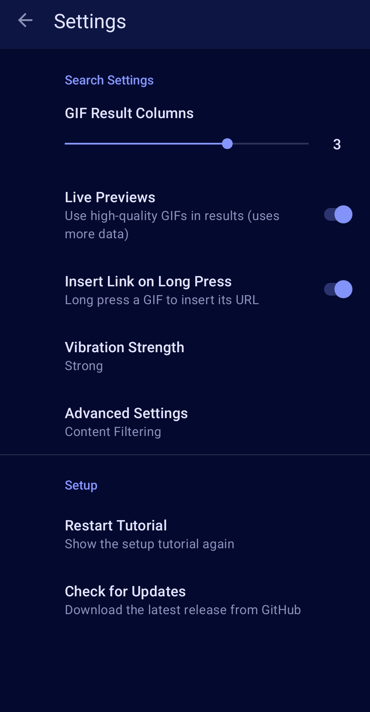

# GifBoard - GIF Search Keyboard


GifBoard is an Android Input Method Editor (IME) built for finding and sharing GIFs. It is a specialized companion tool designed to work alongside your primary text keyboard.

> [!IMPORTANT]
> **GIF-Only Input**: GifBoard is designed exclusively for GIF input. It is not a replacement for a text keyboard but a specialized input method for GIF search and insertion. You will need to switch between it and your primary keyboard dynamically.

[](https://github.com/gifboard/gifboard/releases/latest)

## Features

- **Discovery & Insertion**:
    - **Native Image Support**: Inserts GIF files into apps that support direct image commits (e.g., WhatsApp, Telegram, Google Messages).
    - **Metadata & Embeds**: Uses IME APIs to provide metadata for GIF embeds in compatible apps (e.g., Discord, Slack).
    - **Automatic Fallback**: Inserts a direct URL if the target app does not support rich content.
    - **Search History**: Stores recent queries for quick access.

- **System Integration**:
    - **Material You Design**: Updates its interface colors based on the Android system's dynamic color palette (Android 12+).
    - **Configurable Layout**: Supports a 1 to 4 column grid for search results with optional high-quality previews.

- **Input & Control**:
    - **Adjustable Haptics**: Vibration feedback with Light, Medium, and Strong strength settings.
    - **Functional Enhancements**: Includes repeating backspace for continuous deletion and automated search bar focus handling.
    - **Configurable SafeSearch**: Provides Strict, Moderate, and Off filtering levels, protected by an age verification dialog.

## How to Use

Since GifBoard is only for GIF searching, you'll want to switch between it and your primary keyboard (like Gboard) dynamically.

### 1. Enable GifBoard
1. Open your device **Settings**.
2. Go to **System** > **Languages & input** > **On-screen keyboard**.
3. Tap **Manage on-screen keyboards** and toggle **GifBoard** to **On**.
4. Confirm any security prompts (this is a standard Android warning for all third-party keyboards).

### 2. Switch Keyboards While Typing
1. Open any app and tap a text field to bring up your current keyboard.
2. Look for the **Switching Icon** (varies by device and Android version):
    - **Keyboard icon** (⌨️): Usually in the bottom-right or bottom-left corner of the navigation bar.
    - **Globe icon** (🌐): Often found on the keyboard itself (especially in Gboard) next to the spacebar.
    - **Long-press Spacebar**: Many devices allow you to switch by long-pressing the spacebar.
    - **Notification**: Some older devices show a "Change keyboard" option in the notification shade while typing.
3. Tap the icon (or long-press space) and select **GifBoard** from the list.
4. To go back to typing text, use the same keyboard switcher.

## Screenshots

<p align="center">
  
  
</p>

## Installation

### Download

Download the latest APK from the [Releases page](https://github.com/gifboard/gifboard/releases/latest) and install it on your Android device.

### Build from Source

1. Clone the repository:
   ```bash
   git clone https://github.com/gifboard/gifboard.git
   ```
2. Open the project in Android Studio.
3. Build and run the app on your device or emulator.

Alternatively, use Gradle:
```bash
./gradlew assembleDebug
```

### Release Build

To build a signed release APK, you need to provide the signing properties via Gradle project properties.

1.  **Properties required:**
    - `RELEASE_STORE_FILE`: Path to your keystore file.
    - `RELEASE_STORE_PASSWORD`: Keystore password.
    - `RELEASE_KEY_ALIAS`: Key alias.
    - `RELEASE_KEY_PASSWORD`: Key password.

2.  **How to specify them:**

    **Option A: Command Line**
    ```bash
    ./gradlew assembleRelease \
      -PRELEASE_STORE_FILE=/path/to/release.jks \
      -PRELEASE_STORE_PASSWORD=your_password \
      -PRELEASE_KEY_ALIAS=your_alias \
      -PRELEASE_KEY_PASSWORD=your_password
    ```

    **Option B: `gradle.properties` (Private)**
    Add these to your local `~/.gradle/gradle.properties` to avoid committing them to version control:
    ```properties
    RELEASE_STORE_FILE=/path/to/release.jks
    RELEASE_STORE_PASSWORD=your_password
    RELEASE_KEY_ALIAS=your_alias
    RELEASE_KEY_PASSWORD=your_password
    ```

### Generating a Release Key

If you do not have a release keystore, you can generate one using the `keytool` command:

```bash
keytool -genkey -v -keystore my-release-key.keystore -alias gifime -keyalg RSA -keysize 2048 -validity 10000
```

Follow the prompts to enter your keystore and key passwords, as well as your organizational details. Once generated, move the file to a secure location and update your `gradle.properties` as described above.

## Contributing

Contributions are welcome! Please feel free to submit pull requests or open issues.

## License

This project is licensed under the GNU General Public License v3.0 - see the [LICENSE](LICENSE) file for details.
